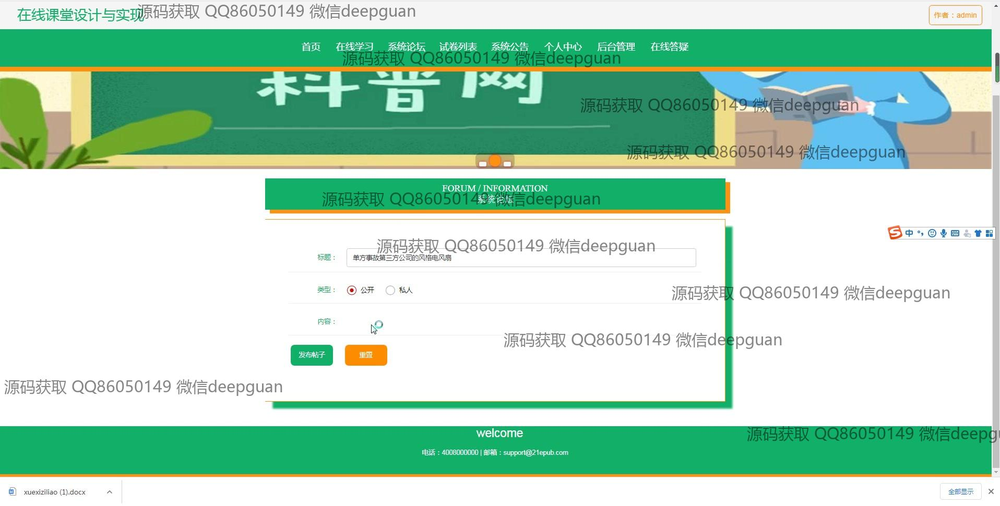
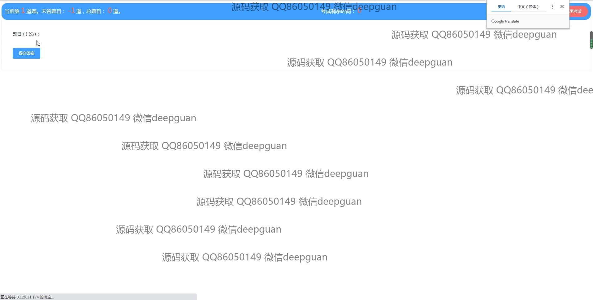

<h1 align="center">的在线课堂学习设计试题试卷vue</h1>

## 简介
在线课堂学习平台：角色分为管理员、用户；功能包括个人中心、用户管理、课程管理、考试管理、论坛系统、公告发布、在线学习和试题设计管理。    --计算机毕业设计源码；毕设源码；java毕业设计源码

## 联系方式

<h3 align="center">获取完整代码与数据库文件 + 微信：deepguan QQ: 86050149 QQ群: 783742310</h3>

<h3 align="center">可帮忙远程部署 包运行成功！提供远程部署、修改代码、设计文档指导、代码讲解等服务！</h3>

## 功能介绍（完整见运行截图）
管理员：基本功能包括登录、注册、退出，以及在网站首页管理主导航栏，公告和系统设置。负责用户管理、课程管理、公告发布和论坛管理等系统后台操作，包含查看和编辑用户信息、维护课程资源、管理系统公告和处理论坛帖子。还需有效利用系统提供的试卷管理、考试设置和在线答疑功能，确保系统的平稳运行。

教师：主要负责课程相关的管理和教学活动，课程分类管理提供了课程内容上传、素材编辑和学习资料添加的选项。可以通过试题管理模块创建和编辑试题，设定试题类型、分数和正确答案。教师可以通过在线学习管理平台，上传视频和音频资料，设计在线测验和考试，并查看学生的学习进度和考试结果，提供个性化辅导。

学生：基本功能包括通过登录入口访问系统，能够在线学习相关课程，系统论坛提供与教师和其他学生的互动交流。可浏览和搜索课程类型，在线查阅课程内容，下载学习材料。在考试管理模块，学生可以参加在线考试，实时查看和提交答卷，并随时查看自己的学习记录和成绩，增强自我学习和评价的能力。

一般用户：主要通过登录界面进行身份认证后，参与系统提供的学习管理与交流平台。通过个人中心管理个人信息并查看学习进度，浏览并参与论坛互动，关注最新的系统公告。可以利用系统内置的教材和试卷资源进行自我提高，一键切换角色选择不同的学习和管理权限。

## 运行截图

本代码来源于网络,仅供学习参考使用!

